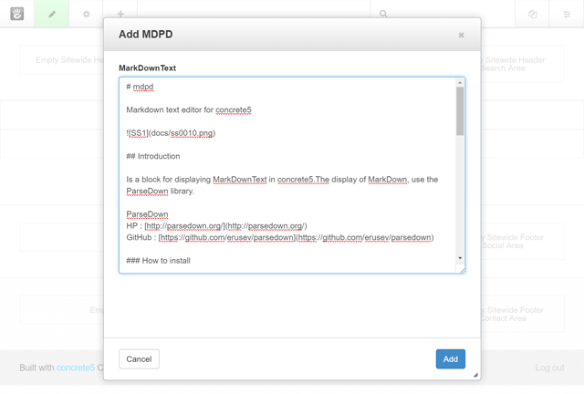
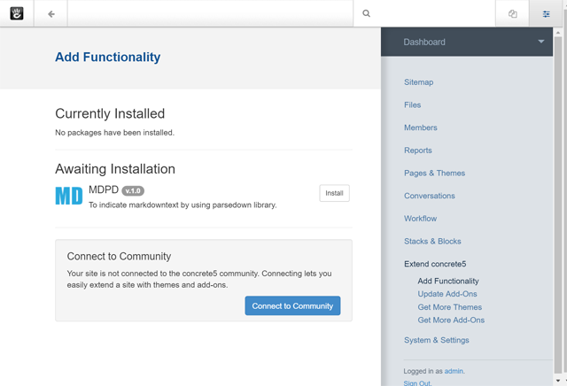
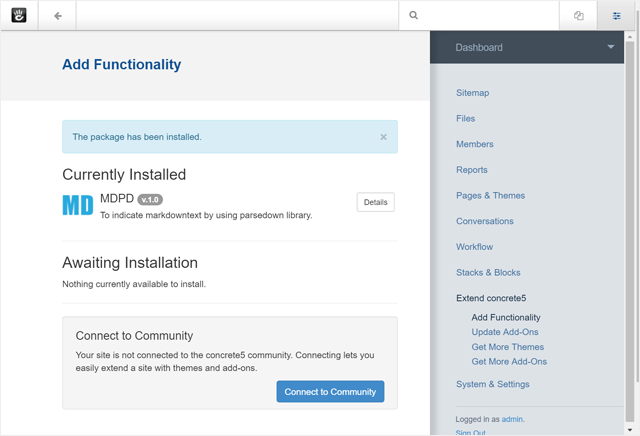
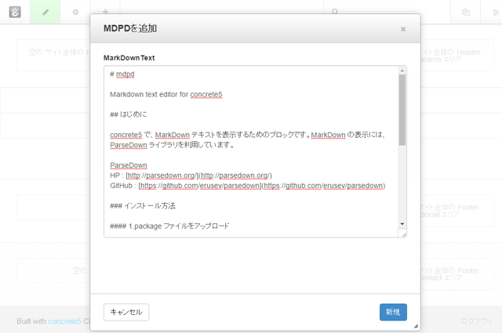
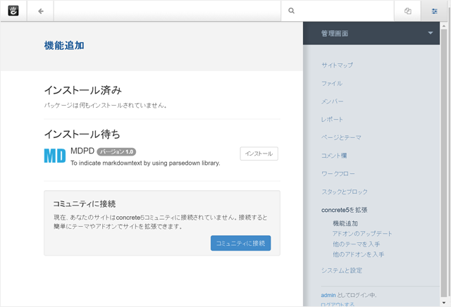
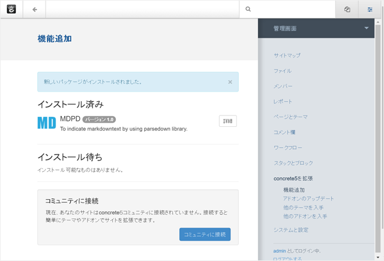

# mdpd for concrete5.7

This is the Markdown text editor for concrete5

## Introduction

This is the text block for displaying MarkDownText in concrete5. To see the MarkDown, use the ParseDown library.

ParseDown  
HP : [http://parsedown.org/](http://parsedown.org/)  
GitHub : [https://github.com/erusev/parsedown](https://github.com/erusev/parsedown)  

### How to install

#### 1.Upload package files.

Upload the downloaded file to the '/packages' folder of concrete5.

#### 2.Install the package.

The installation waiting , you can see the MDPD. Please install by clicking the install button.

#### 3.Completion of installation.

When the installation is successful , it will be displayed on the installed.Now it is available.

----

## はじめに

concrete5 で、MarkDown テキストを表示するためのブロックです。MarkDown の表示には、ParseDown ライブラリを利用しています。

ParseDown  
HP : [http://parsedown.org/](http://parsedown.org/)  
GitHub : [https://github.com/erusev/parsedown](https://github.com/erusev/parsedown)  

### インストール方法

#### 1.package ファイルをアップロード

ダウンロードしたファイルを concrete5 の /packages フォルダにアップロードします。

#### 2.package をインストールします

インストール待ちに、MDPD が表示されています。[インストール]をクリックしてインストールしてください。

#### 3.インストールの完了

インストールが成功すると、インストール済みに表示されます。利用可能になりました。

